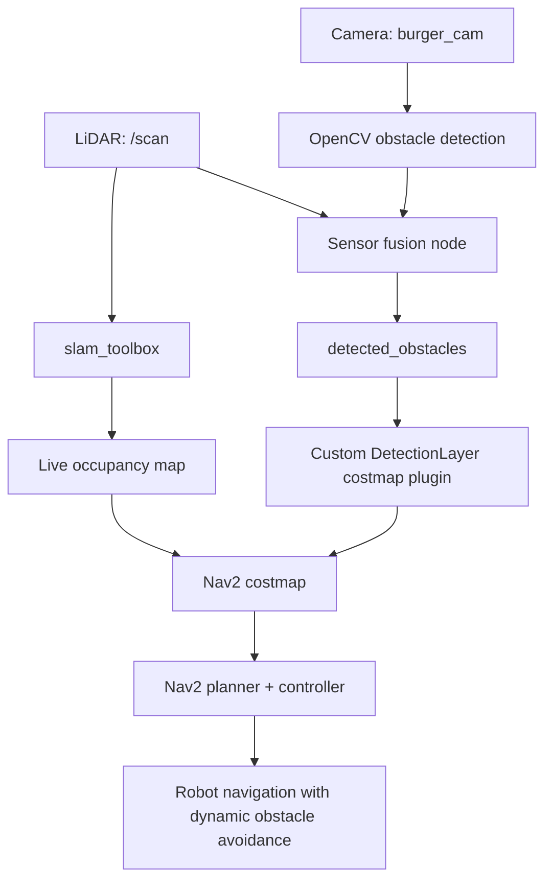
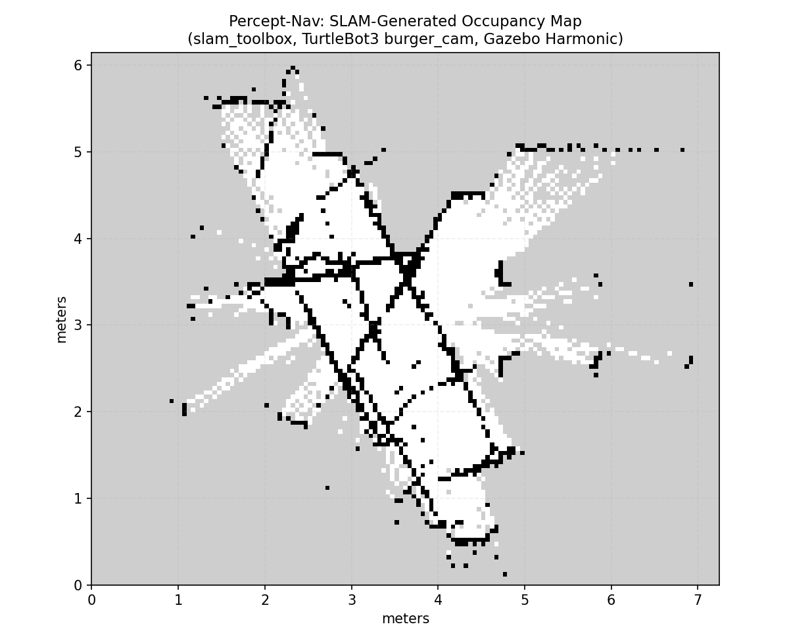

# Percept-Nav: Real-Time Multi-Sensor SLAM & Dynamic Obstacle Navigation Stack

A ROS2 Jazzy + Gazebo Harmonic robotics perception and navigation
pipeline built on a TurtleBot3, combining classical computer vision,
LiDAR sensor fusion, live SLAM mapping, and a custom Nav2 costmap plugin
for dynamic obstacle avoidance.

Built as a scoped, task-based portfolio project to close specific,
verifiable skill gaps in perception, SLAM, and navigation.

## What it does

1. Perception: OpenCV obstacle detection on the burger_cam camera feed.
2. Sensor fusion: camera detections fused with LiDAR range data.
3. SLAM: slam_toolbox builds a live occupancy map.
4. Custom Nav2 costmap layer: a hand-written C++ plugin feeds fused
   detections into Nav2's costmap.
5. Dynamic obstacle avoidance: verified against moving obstacles,
   including a stress test up to 8 simultaneous obstacles at 4x speed.

## Architecture



## Skills demonstrated

| Area | What was built |
|---|---|
| Computer vision | Classical OpenCV pipeline with a fully documented debugging journey through 7 failed approaches |
| Sensor fusion | Time-synchronized camera+LiDAR fusion using message_filters |
| SLAM | slam_toolbox live mapping, real parameter tuning, save/reload verified |
| Nav2 internals | Custom C++ costmap layer plugin, verified running in a real Nav2 stack |
| Systems debugging | Multiple real infrastructure issues diagnosed with direct evidence |

## Repo structure
## Setup and running

Requires ROS2 Jazzy, Gazebo Harmonic, and the TurtleBot3 packages.

```bash
cd ~/ros2_ws
colcon build --packages-select percept_nav percept_nav_costmap_plugin
source install/setup.bash
export TURTLEBOT3_MODEL=burger_cam

# Terminal 1: simulation
ros2 launch percept_nav percept_nav_headless.launch.py

# Terminal 2: SLAM
ros2 launch slam_toolbox online_async_launch.py slam_params_file:=src/percept_nav_repo/percept_nav/config/mapper_params_tuned.yaml use_sim_time:=true

# Terminal 3: Nav2
ros2 launch nav2_bringup navigation_launch.py params_file:=src/percept_nav_repo/percept_nav/config/nav2_params.yaml use_sim_time:=true
```


## Results

See docs/notes/stage4_benchmark_results.md for the full evidence-based
results summary, including:
- Verified real-time costmap response to moved obstacles
- Stress test up to 8 simultaneous obstacles at 4x speed, no failures found
- An honestly documented environment failure mode (Nav2 lifecycle
  auto-recovery from an internal node heartbeat timeout)

Sample SLAM-generated map:



## Known limitations (stated honestly)

- The custom costmap layer marks a fixed-radius region around the
  robot's position for valid detections, rather than each detection's
  precise geometric location -- documented as a scoped simplification.
- A full 40-trial automated benchmark sweep was attempted but not
  completed due to real, documented bugs in the trial-automation script;
  results instead rely on individually verified evidence. See DEVLOG.md
  for the complete honest account.
- Developed and tested in WSL2, which has real GPU rendering limitations
  for Gazebo's OGRE-Next renderer -- development was done in headless
  mode as a documented, deliberate workaround.

## Development process

This project's DEVLOG.md documents every task's real development
process -- decisions made, bugs hit, and how they were diagnosed and
fixed -- rather than presenting only a polished final result. Technical
deep-dives on specific concepts are in docs/notes/.

## License

MIT -- see LICENSE
